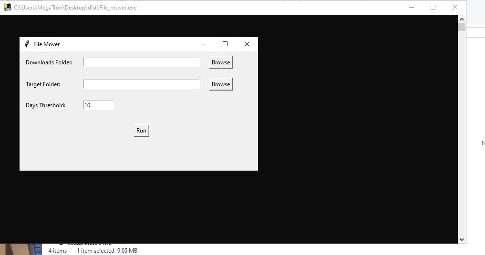
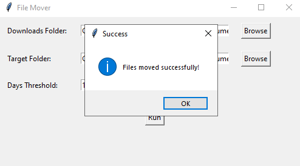

# SpaceManager

SpaceManager is a lightweight, cross-platform application designed to keep your system’s main drive clean by automatically managing downloaded files. This tool moves files from a designated downloads folder to an external storage or another folder based on the age of the file. With SpaceManager, you can avoid disk space clutter and ensure optimal storage management.

## Features

- **Automated File Management**: Automatically moves files from a specified downloads folder to a target location if they exceed a specified age.
- **Customizable Threshold**: Set the number of days after which files are moved.
- **Cross-Platform Compatibility**: Works seamlessly on both Windows and Linux.
- **System Tray Integration**: Runs in the background with a convenient system tray icon for easy access.
- **Notifications**: Provides notifications when files are moved, keeping you informed.
- **Simple GUI**: Built with a user-friendly interface using PyQt, making setup and configuration easy.

## Installation

### For Windows (Executable)

1. Download the latest version of **SpaceManager.exe** from the [releases](https://github.com/mohammadajani/SpaceManager/releases) page.
2. Run `SpaceManager.exe`. No installation is required, and you can start using the app right away!

> **Note:** The executable version requires no additional setup but may trigger security warnings. If prompted, allow the app to run.

### For Python Users

If you'd prefer to run **SpaceManager** directly from the source code (for example, on Linux), you’ll need:

- **Python 3.x**: Make sure Python 3.x is installed. You can download it [here](https://www.python.org/downloads/).
- **PyQt5**: Install PyQt5 to enable the GUI components. You can install it via pip:

  ```bash
  pip install PyQt5
  ```

### Clone the Repository

```bash
git clone https://github.com/mohammadajani/SpaceManager.git
cd SpaceManager
```

### Run the Application

Execute the application by running:

```bash
python space_manager.py
```

## Building the Executable Yourself

If you want to create your own executable using **PyInstaller**, follow these steps:

1. Install PyInstaller if you haven’t already:
   ```bash
   pip install pyinstaller
   ```
2. In the root directory of the project, run PyInstaller with the following command:
   ```bash
   pyinstaller --onefile --windowed space_manager.py --icon=assets/icon.ico
   ```
   This will create a standalone executable file located in the `dist` folder.

## Usage

1. **Configure Folders**: Set the source folder (usually your downloads folder) and the target folder where old files should be moved.
2. **Set Days Threshold**: Specify the number of days after which files should be moved.
3. **Start Monitoring**: Click "Start Monitoring" to begin. The application will minimize to the system tray and start monitoring in the background.
4. **Exit**: Right-click the tray icon to exit the application.

## Screenshots

### Main Interface


### System Tray Notification


## Code Structure

```plaintext
SpaceManager/
├── space_manager.py          # Main application file
├── assets/
└── README.md                 # Project documentation
```

## Contributing

We welcome contributions to SpaceManager! To get started:

1. Fork the repository and create a new branch for your feature.
2. Open a pull request with a detailed description of your changes.

## Roadmap

- [ ] Monitoring mode To monitor in background and move old files to Specified directory
- [ ] Optimize GUI
- [ ] Add configuration options to customize monitoring intervals.
- [ ] Implement a preview mode to display files before they are moved.
- [ ] Provide more extensive logging and error handling.

## License

This project is licensed under the MIT License. See the [LICENSE](LICENSE) file for details.

## Contact

For questions or suggestions, feel free to open an issue or reach out:

- **Email**: mohammedajani18@gmail.com
- **GitHub**: [mohammadajani](https://github.com/mohammadajani)
